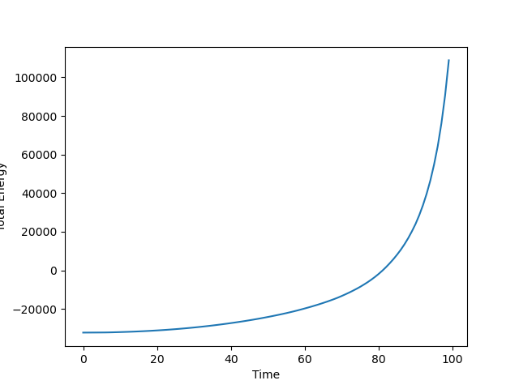
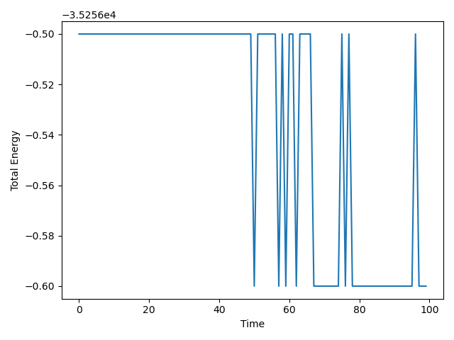
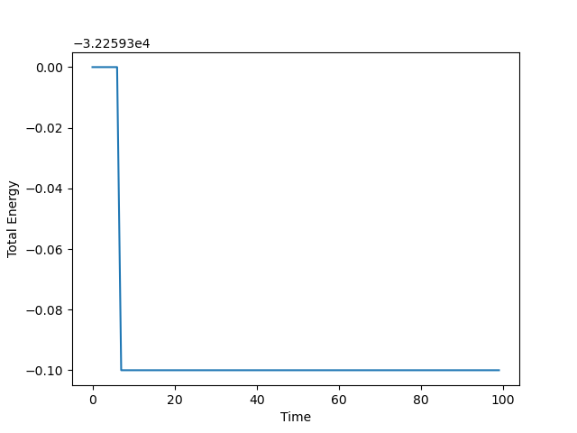
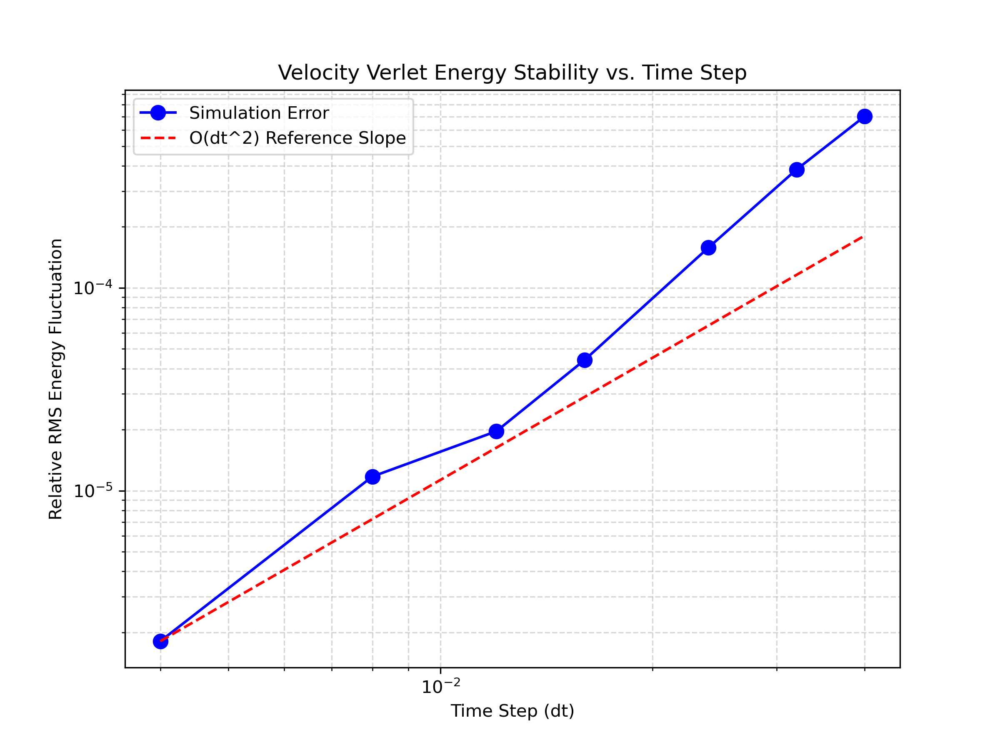
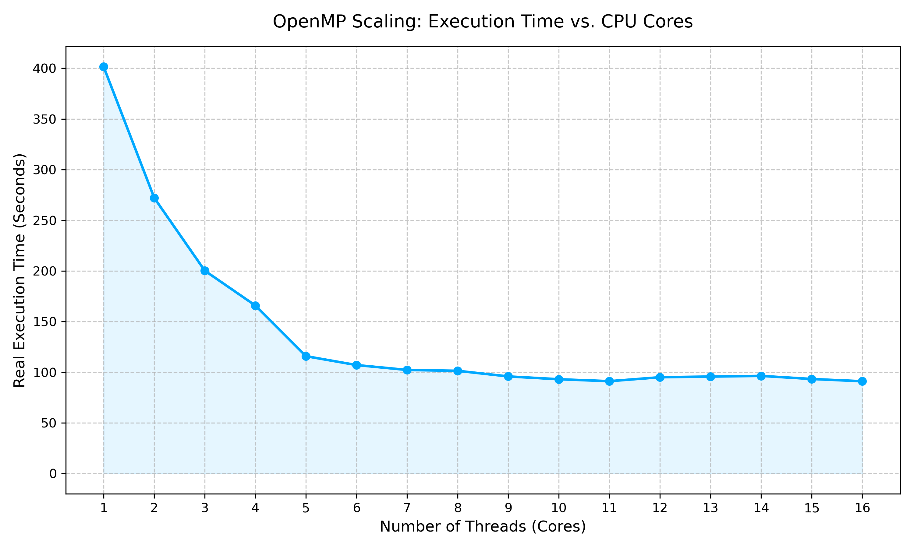
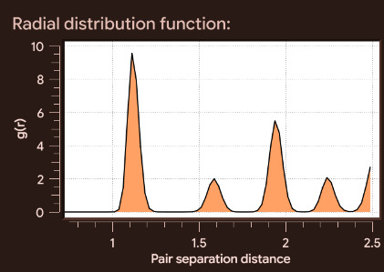
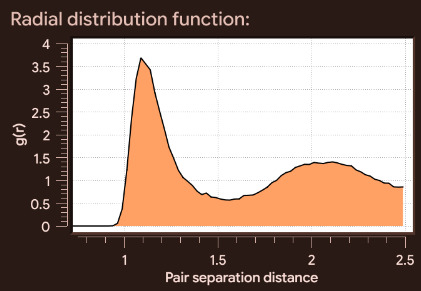

# MD-Engine: A 3D C++ Molecular Dynamics Engine

## Overview

A 3D Molecular Dynamics Engine written in C++.

Currently, this project implements the following

- Create a 3D N body simulation framework in C++ with Periodic Boundary Conditions(PBC).
- Implement a standard Lennard-Jones (LJ) potential to model a simple noble gas.
- Implement multiple numerical integrators, specifically: Forward Euler, Velocity Verlet, and DKD Leapfrog methods.
- Parallelization using OpenMP
- Simulate distinct thermodynamic ensembles (NVE and NVT) using custom thermostats to model macroscopic phase transitions.

## Quick Start & Installation

The project uses `CMake` for building and depends on OpenMP for multithreading.

```bash
git clone https://github.com/Jedop/md-engine.git
cd md-engine
cmake -S . -B build -DCMAKE_BUILD_TYPE=Release
cmake --build build -j
```

### Command Line Interface (CLI)

The engine features a custom argument parser for rapid experiment testing without recompilation.

```bash
Usage: ./MD_Engine [options]

--dt <value>
    Integration time step Δt (default: 0.001)

--frames <value>
    Total number of timesteps to simulate

--rho <value>
    Target number density ρ (used to compute box size)

--fcc / --sc
    Choose initial lattice configuration:
      --fcc → Face-Centered Cubic (default)
      --sc  → Simple Cubic

--particles-per-side <int>
    Number of particles per dimension (used for SC lattice)

--unit-cells <int>
    Number of FCC unit cells per dimension (used for FCC lattice)

--turn-off-thermostat
    Disable Berendsen thermostat (switches from NVT → NVE ensemble)

--target-T <value>
    Target temperature for thermostat (in LJ reduced units)

--anneal
    Gradually cool system from high T to low T during simulation

--time-reversal
    Perform time-reversibility test:
    reverse velocities halfway through the simulation

--traj <file>
    Output trajectory file (.xyz format)

--data <file>
    Output thermodynamic data file (energy, temperature, etc.)
```

### Output

It outputs two files, a .xyz file and .dat file. The xyz file contains the raw positions of the particles at each timestep, and the .dat file contains the Potential Energy U, the Kinetic Energy T, the Total Energy E, and the Temperature T.

## Key Features

- **Cell lists**: Divides the space into cubes to optimize the Force Calculation Algorithm from $O(N^2)$ to $O(N)$, enabling simulation of 8000 particles for 10,000 timesteps in 170s.
- **OpenMP Parallelization**: Utilizes lock-free, thread-local array reductions to eliminate data races, achieving a ~5x speedup (simulating 8,000 particles for 10,000 timesteps in ~90 seconds).
- **Thermodynamic Control**: Features Velocity Rescaling and Berendsen thermostats for precise temperature manipulation and NVT ensemble sampling.
- **Multiple Integrators**: This enables comparison and numerical analyses of various methods of integration.

## Physics & Implementation Details

To ensure physical accuracy and numerical stability, the engine implements standard molecular dynamics conventions:

- **Lennard-Jones Reduced Units**: All calculations (mass, energy, distance, time) are performed in dimensionless LJ reduced units to prevent floating-point underflow/overflow.
- **Initialization**: Particles are initialized in a stable 3D lattice configuration. Initial velocities are assigned randomly centered at 0 to avoid large drift velocities.
- **Minimum Image Convention (MIC):** Implemented for calculating the shortest distance between particles across Periodic Boundary Conditions without expensive division operations.
- **Force Truncation**: The LJ potential is cut off at $r_c = 2.5\sigma$ to optimize calculations.
- **Ensemble Control**: The engine defaults to the Microcanonical (NVE) ensemble where total energy is strictly conserved. It can be dynamically coupled to an external heat bath using a Berendsen thermostat to sample the Canonical (NVT) ensemble.

## Numerical Analysis

### Euler vs Leapfrog vs Velocity Verlet

| Integrator                  | Euler                            | Leapfrog                               | Velocity Verlet                                     |
| --------------------------- | -------------------------------- | -------------------------------------- | --------------------------------------------------- |
| **Energy over time**        |  |  |  |
| Relative Energy Fluctuation | 2.08                             | $1.34 \times 10^{-6}$                  | $7.91 \times 10^{-7}$                               |

- **Euler**: Energy increases exponentially over time, since it is **not** a symplectic integrator. This rules out Euler integration for this project. It has a **Relative RMS Energy Fluctuation ($\frac{\sigma_E}{|\langle E \rangle|}$) of $2.08$** which is abysmal.
- **Leapfrog**: Energy is conserved over time, since it is a symplectic integrator. It has a **Relative RMS Energy Fluctuation ($\frac{\sigma_E}{|\langle E \rangle|}$) of $1.34 \times 10^{-6}$** which is very good.
- **Velocity Verlet**: Energy is also conserved in this case, as it is a symplectic integrator as well. It has a **Relative RMS Energy Fluctuation ($\frac{\sigma_E}{|\langle E \rangle|}$) of $7.91 \times 10^{-7}$** which is excellent.

#### Why Velocity Verlet over Leapfrog?

Clearly, the difference in energy drift between Leapfrog and Velocity Verlet Integration is close to negligible. One might wonder then, why choose one over the other?

In our case, it is very clear that Velocity Verlet is the superior choice. This is because the Leapfrog method is such that at each timestep n, the calculated positions(x) are at timestep n, but the calculated velocities(v) are at timestep $(n + 1/2)$. This means, every time we want to calculate the kinetic energy(or any quantity involving the velocities of the particles), we need to take it back a half-step outside of the main loop, and **then** calculate the required quantities. This is clearly suboptimal. This is a non-issue for Velocity Verlet, as it always works with a full step of velocity and position at the end of each timestep. This makes it the superior choice for Molecular Dynamics, where quantities involving position and velocity must be calculated often.

### Error Scaling

The Velocity Verlet Method has an error of O($\Delta t^{2}$). Thus, the overall error of our engine should also follow that, considering there are no other factors in our engine contributing to it. Testing it for various timesteps, we get the following graph



As we can see, it follows a quadratic curve on the loglog plot, thus confirming the accuracy of our method.

Note: Relative error is defined as the normalized drift in total energy:
$\frac{|E(t) - E(0)|}{|E(0)|}$

### Time Reversal

Without a thermostat, the dynamics are time-reversible. If the system is evolved forward for N timesteps and all velocities are then reversed, evolving for another N timesteps should return the system to its initial state (up to numerical error). This provides a simple diagnostic for the accuracy of the integrator.

Doing so, we get the following:

- Error for 2k timesteps total(1k forward, 1k reverse): $1.44 \times 10^{-14}$
- Error for 20k timesteps total(10k forward, 10k reverse): $1.81 \times 10^{-13}$

which confirms that our engine obeys the laws of physics reasonably well.

Note: The time-reversibility error is computed as $\max_i \|\mathbf{r}_i^{\text{final}} - \mathbf{r}_i^{\text{initial}}\|$.

### OpenMP Parallelization & Hardware Scaling

To address the $O(N)$ force-calculation bottleneck, the engine was parallelized using **OpenMP**.
A naive parallelization of Newton's 3rd Law ($F_{ij} = -F_{ji}$) introduces fatal memory race conditions. Using `#pragma omp atomic` locks prevents data corruption but destroys cache performance and parallel speedup.

Instead, the engine utilizes a thread-local 2D accumulation array (`thread_acc[num_threads][N]`) hoisted outside the time loop. Threads write independently to their respective memory blocks, followed by a delayed `#pragma omp parallel for` reduction.



As shown in the hardware scaling benchmark, this architecture yields a **5x linear speedup** (dropping execution time from 6.5 minutes to ~1.5 minutes for large systems), successfully saturating the physical P-Cores and memory bandwidth of the deployment hardware.

## Thermodynamics & Phase Transitions

To simulate specific states of matter, the engine supports transitioning from an isolated **NVE (Microcanonical) ensemble** to a thermally controlled **NVT (Canonical) ensemble** via custom thermostats.

- **Velocity Rescaling:** Forces instantaneous temperature convergence, but artificially suppresses natural kinetic energy fluctuations (creating an non-physical isokinetic ensemble).
- **Berendsen Thermostat:** Weakly couples the system to an external heat bath with a time constant $\tau$. This allows for smooth, physically realistic equilibration and energy transfer.

### Radial Distribution Function (RDF)

By modulating the density ($\rho^*$) and implementing the Berendsen thermostat, the engine successfully triggers and measures macroscopic phase transitions. The internal structure is verified using the Radial Distribution Function, $g(r)$:

<p align="center">
  
  
</p>

- **Left (Low Temperature Solid):** At $T^* = 0.1$, the system remains in a crystalline FCC-like state. This is reflected in the sharp first peak and the presence of well-defined subsequent peaks at specific separations, corresponding to distinct coordination shells. The long-range oscillations in $g(r)$ indicate strong positional order characteristic of a solid phase.

- **Right (High Temperature Fluid):** At $T^* = 1.5$, thermal motion disrupts the lattice structure, and the system transitions to a fluid-like state. The first peak becomes broader and less pronounced, and the higher-order peaks are significantly damped. The gradual decay of $g(r) \to 1$ reflects the loss of long-range order, consistent with a dense fluid.

## Visualization

The engine outputs raw trajectory data in the standard `.xyz` file format. This allows for integration with scientific visualization software like **OVITO**.


---
