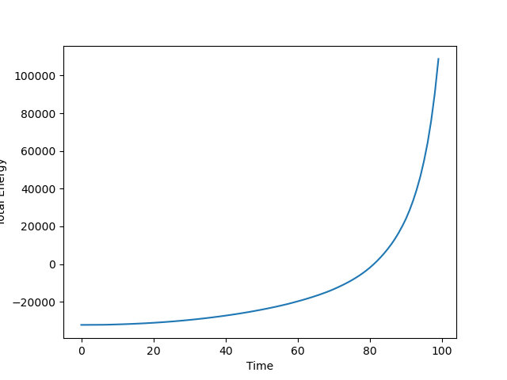
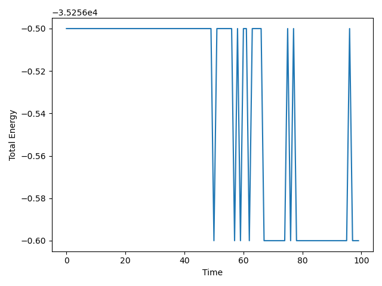
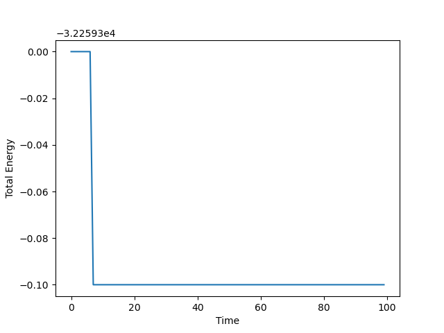
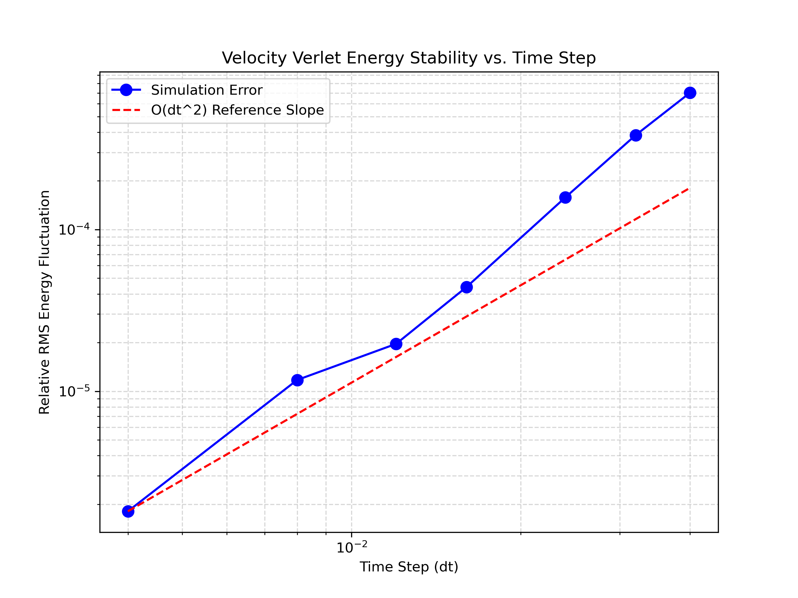
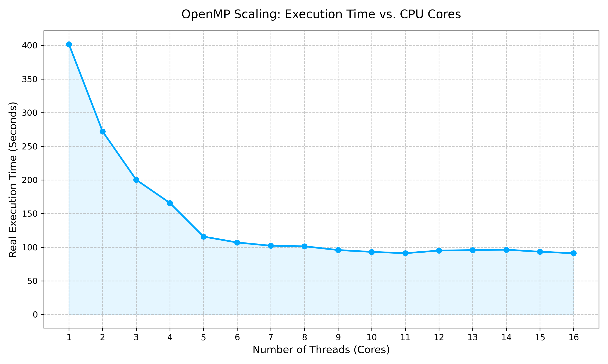
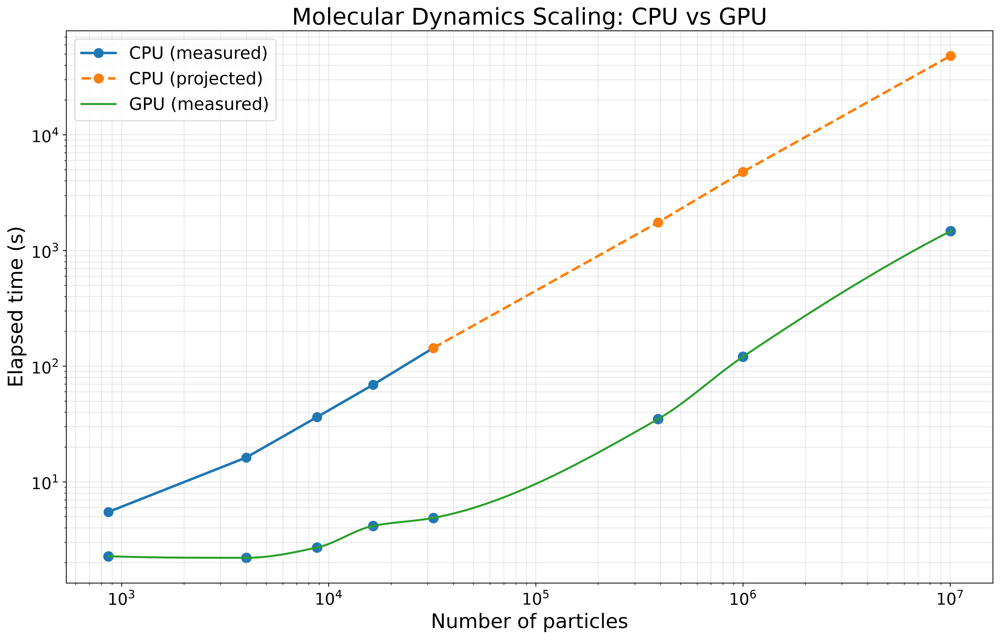
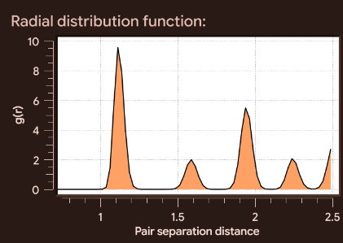
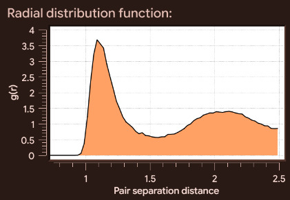
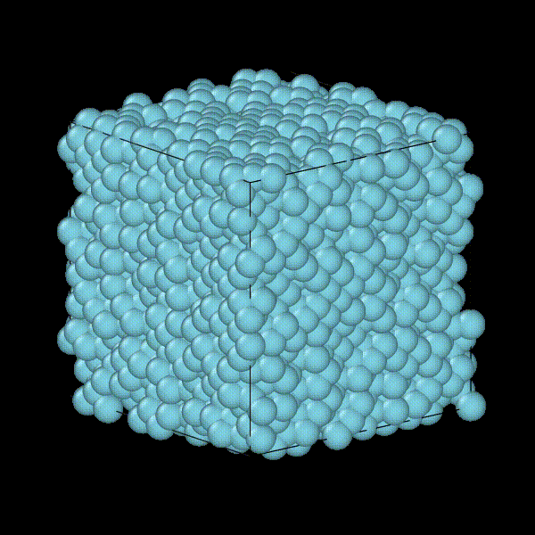

# MD-Engine: A 3D CUDA C++ Molecular Dynamics Engine

## Overview

A 3D Molecular Dynamics Engine written in C++, which can simulate 1M particles in 2 minutes(~121s).

Currently, this project implements the following

- A 3D N body simulation framework in C++ with Periodic Boundary Conditions(PBC).
- A standard Lennard-Jones (LJ) potential to model a simple noble gas.
- Multiple numerical integrators, specifically: Forward Euler, Velocity Verlet, and DKD Leapfrog methods.
- Parallelization using OpenMP
- Simulate distinct thermodynamic ensembles (NVE and NVT) using custom thermostats to model macroscopic phase transitions.
- Dual Backend, meaning one can switch from CPU execution to GPU execution by passing a parameter to the executable.
- Mixed Precision Architecture on the GPU, due to consumer GPU's having significantly less FP64 computing capabilities.

## Quick Start & Installation

The project uses `CMake` for building and depends on OpenMP for multithreading.

```bash
git clone https://github.com/Jedop/md-engine.git
cd md-engine
cmake -S . -B build -DCMAKE_BUILD_TYPE=Release
cmake --build build -j
```

### Command Line Interface (CLI)

The engine features a custom argument parser for rapid experiment testing without recompilation.

```bash
Usage: ./MD_Engine [options]

--dt <value>
    Integration time step Δt (default: 0.001)

--frames <value>
    Total number of timesteps to simulate

--rho <value>
    Target number density ρ (used to compute box size)

--fcc / --sc
    Choose initial lattice configuration:
      --fcc → Face-Centered Cubic (default)
      --sc  → Simple Cubic

--particles-per-side <int>
    Number of particles per dimension (used for SC lattice)

--unit-cells <int>
    Number of FCC unit cells per dimension (used for FCC lattice)

--thermostat
    Enable/Disable Berendsen thermostat (switches from NVT → NVE ensemble)

--target-T <value>
    Target temperature for thermostat (in LJ reduced units)

--anneal
    Gradually cool system from high T to low T during simulation

--time-reversal
    Perform time-reversibility test:
    reverse velocities halfway through the simulation

--traj <file>
    Output trajectory file (.xyz format)

--data <file>
    Output thermodynamic data file (energy, temperature, etc.)

--backend <value>
    gpu to use the GPU, cpu to use the CPU

--eq-steps <value>
    Runs a <value> number of equilibrium steps where data is not recorded.
```

### Output

It outputs two files, a .xyz file and .dat file. The xyz file contains the raw positions of the particles at each timestep, and the .dat file contains the Potential Energy U, the Kinetic Energy K, the Total Energy E, and the Temperature T.

## Key Features

- **GPU + CPU Backends**: Allows the user to use either the GPU(only NVIDIA GPUs) or the CPU.
- **Cell lists**: Divides the space into cubes to optimize the Force Calculation Algorithm from $O(N^2)$ to $O(N)$, enabling simulation of 8000 particles for 10,000 timesteps in 170s, on the CPU, without Parallelization.
- **OpenMP Parallelization**: Utilizes lock-free, thread-local array reductions to eliminate data races, achieving a ~5x speedup (simulating 8,000 particles for 10,000 timesteps in ~36 seconds) on the CPU.
- **Thermodynamic Control**: Features Velocity Rescaling and Berendsen thermostats for precise temperature manipulation and NVT ensemble sampling.
- **Multiple Integrators**: This enables comparison and numerical analyses of various methods of integration.
- **Spatial Hashing**: Analogous to the Cell linked lists on the CPU, implements cells in the GPU, sorts the particles according to the Cell IDs, and calculates the forces. Optimizes from $O(N^2)$ to $O(N)$.
- **Mixed Precision Architecture**: The GPU uses Mixed Precision due to consumer NVIDIA GPUs having a significantly lower number of FP64 cores. The CPU remains on fully double precision architecture.

## Physics & Implementation Details

To ensure physical accuracy and numerical stability, the engine implements standard molecular dynamics conventions:

- **Lennard-Jones Reduced Units**: All calculations (mass, energy, distance, time) are performed in dimensionless LJ reduced units to prevent floating-point underflow/overflow.
- **Initialization**: Particles are initialized in a stable 3D lattice configuration. Initial velocities are assigned randomly centered at 0 to avoid large drift velocities.
- **Minimum Image Convention (MIC):** Implemented for calculating the shortest distance between particles across Periodic Boundary Conditions without expensive division operations.
- **Force Truncation**: The LJ potential is cut off at $r_c = 2.5\sigma$ to optimize calculations.
- **Ensemble Control**: The engine defaults to the Microcanonical (NVE) ensemble where total energy is strictly conserved. It can be dynamically coupled to an external heat bath using a Berendsen thermostat to sample the Canonical (NVT) ensemble.

## Numerical Analysis

> **Benchmark note:** The performance numbers reported below were measured on my local hardware and will vary depending on the CPU, GPU, memory, drivers, and system load.

### Benchmark Hardware

- **CPU:** 12th Gen Intel Core i7-12650H
- **GPU:** NVIDIA GeForce RTX 3070 Ti Laptop GPU (8 GB VRAM)
- **RAM:** 16 GB
- **NVIDIA Driver:** 610.43.03
- **CUDA:** 13.2
- **OS:** EndeavourOS Linux

### Euler vs Leapfrog vs Velocity Verlet

| Integrator                  | Euler                            | Leapfrog                               | Velocity Verlet                                     |
| --------------------------- | -------------------------------- | -------------------------------------- | --------------------------------------------------- |
| **Energy over time**        |  |  |  |
| Relative Energy Fluctuation | 2.08                             | $1.34 \times 10^{-6}$                  | $7.91 \times 10^{-7}$                               |

- **Euler**: Energy increases exponentially over time, since it is **not** a symplectic integrator. This rules out Euler integration for this project. It has a **Relative RMS Energy Fluctuation ($\frac{\sigma_E}{|\langle E \rangle|}$) of $2.08$** which is abysmal.
- **Leapfrog**: Energy is conserved over time, since it is a symplectic integrator. It has a **Relative RMS Energy Fluctuation ($\frac{\sigma_E}{|\langle E \rangle|}$) of $1.34 \times 10^{-6}$** which is very good.
- **Velocity Verlet**: Energy is also conserved in this case, as it is a symplectic integrator as well. It has a **Relative RMS Energy Fluctuation ($\frac{\sigma_E}{|\langle E \rangle|}$) of $7.91 \times 10^{-7}$** which is excellent.

> *Note: The above metrics were benchmarked on the CPU backend (FP64). The GPU backend utilizes a Mixed-Precision architecture (FP32 forces, FP64 accumulation) to bypass consumer hardware FP64 throttling. Despite the use of single-precision for intermediate distances, the GPU engine maintains an Relative RMS Energy Fluctuation of $< 10^{-7}$ in the NVE ensemble.*

#### Why Velocity Verlet over Leapfrog?

Clearly, the difference in energy drift between Leapfrog and Velocity Verlet Integration is close to negligible. One might wonder then, why choose one over the other?

In our case, it is very clear that Velocity Verlet is the superior choice. This is because the Leapfrog method is such that at each timestep n, the calculated positions(x) are at timestep n, but the calculated velocities(v) are at timestep $(n + 1/2)$. This means, every time we want to calculate the kinetic energy(or any quantity involving the velocities of the particles), we need to take it back a half-step outside of the main loop, and **then** calculate the required quantities. This is clearly suboptimal. This is a non-issue for Velocity Verlet, as it always works with a full step of velocity and position at the end of each timestep. This makes it the superior choice for Molecular Dynamics, where quantities involving position and velocity must be calculated often.

### Error Scaling

The Velocity Verlet Method has an error of O($\Delta t^{2}$). Thus, the overall error of our engine should also follow that, considering there are no other factors in our engine contributing to it. Testing it for various timesteps, we get the following graph



As we can see, it follows a quadratic curve on the loglog plot, thus confirming the accuracy of our method.

Note: Relative error is defined as the normalized drift in total energy:
$\frac{|E(t) - E(0)|}{|E(0)|}$

### Time Reversal

Without a thermostat, the dynamics are time-reversible. If the system is evolved forward for N timesteps and all velocities are then reversed, evolving for another N timesteps should return the system to its initial state (up to numerical error). This provides a simple diagnostic for the accuracy of the integrator.

Doing so, we get the following:

- Error for 2k timesteps total(1k forward, 1k reverse): $1.44 \times 10^{-14}$
- Error for 20k timesteps total(10k forward, 10k reverse): $1.81 \times 10^{-13}$

which confirms that our engine obeys the laws of physics reasonably well.

Note: The time-reversibility error is computed as $\max_i \|\mathbf{r}_i^{\text{final}} - \mathbf{r}_i^{\text{initial}}\|$.

> *Note: The above metrics were benchmarked on the CPU backend (FP64). The GPU backend performs similarly, resulting in a $< 10^{-15}$ error for 2k timesteps and ~$10^{-6}$ error for 20k timesteps. This is because of the Mixed Precision Architecture used in the GPU, more specifically, FP32 truncation.*

### OpenMP Parallelization & Hardware Scaling

To address the $O(N)$ force-calculation bottleneck, the engine was parallelized using **OpenMP**.
A naive parallelization of Newton's 3rd Law ($F_{ij} = -F_{ji}$) introduces fatal memory race conditions. Using `#pragma omp atomic` locks prevents data corruption but destroys cache performance and parallel speedup.

Instead, the engine utilizes a thread-local 2D accumulation array (`thread_acc[num_threads][N]`) hoisted outside the time loop. Threads write independently to their respective memory blocks, followed by a delayed `#pragma omp parallel for` reduction.



As shown in the hardware scaling benchmark, this architecture yields a **5x linear speedup** (dropping execution time from 6.5 minutes to ~1.5 minutes for large systems).

## CUDA Parallelization

To get an even more performant engine, a fully data-resident **CUDA** backend was developed. A naive GPU port suffers from two fatal bottlenecks: PCIe bus transfer latency and uncoalesced memory reads caused by standard CPU-style linked lists.

To resolve this, the GPU engine implements **Spatial Hashing**. Particles are assigned 3D cell IDs and physically sorted in VRAM using **NVIDIA Thrust** (`thrust::sort_by_key`). This improves spatial locality during GPU neighbor-list traversal by physically grouping particles belonging to the same cell in VRAM.

Furthermore, to bypass the severe FP64 (Double Precision) hardware throttling on consumer NVIDIA GPUs, the engine utilizes a custom **Mixed-Precision** pipeline:
- Pairwise distances and Lennard-Jones forces are computed in **Single Precision (FP32)**.
- Position/Velocity integration and global energy reductions (via parallel `thrust::reduce` trees) are accumulated in **Double Precision (FP64)**, successfully maintaining exact macroscopic energy conservation.



As shown in the scaling benchmark, The CUDA implementation scales substantially better with increasing particle count. For a mid-sized system of 32,000 particles, the GPU achieves a **~28x execution speedup** (4.87 seconds vs. 136 seconds). However, the true hardware scaling is revealed at macroscopic limits: For 1,000,188 particles over 10,000 timesteps, the GPU completes the simulation in 120.59 s (2 min). The CPU runtime is projected at approximately 4,783 s (80 min) based on the runtime estimate from an interrupted run, corresponding to an estimated ~39.7× speedup. This is all while maintaining an  $< 10^{-7}$ error on global energy conservation. For 10,061,824 particles over 10,000 timesteps, the GPU takes 1471.13s (24.5 min) and for 32,000,000 particles over 10,000 timesteps, the GPU takes 4112.17s (68.5 min).

### Hardware Profiling & Bottleneck Analysis (NVIDIA Nsight Compute)

To validate the CUDA architecture and identify hardware-level bottlenecks, the engine was profiled using NVIDIA Nsight Compute (`ncu`) on an RTX 3070 Ti Laptop GPU.

**Key Telemetry (1,000,000 particles, Mixed Precision):**
*   **Compute (SM) Throughput:** 88.85%
*   **Memory (DRAM) Throughput:** 3.50%
*   **L1/TEX Cache Throughput:** 39.05%
*   **Achieved Occupancy:** 91.85%

**1. Memory Bandwidth Is Not the Bottleneck:**
Naive GPU molecular dynamics is typically memory-bound due to pointer-chasing and uncoalesced VRAM reads. The profiling telemetry confirms that the **Spatial Hashing** and physical memory sorting (via `thrust::sort_by_key`) successfully mitigated this. The DRAM throughput sits at an idle 3.50%, proving that memory latency is no longer the bottleneck. That said, the access pattern itself isn't fully optimal: `ncu` flags uncoalesced global loads (only ~4.2 of 32 bytes/sector utilized) and stores (~19.3 of 32), together representing an estimated 15–33% further speedup if resolved

**2. The Compute Wall (FP32 vs FP64):**
With the memory bottleneck removed, the engine is strictly **Compute-Bound** (SM Throughput at ~89%). The profiler explicitly highlighted the hardware limitation of consumer gaming GPUs: the FP32 to FP64 performance ratio is artificially locked to `64:1`. Simulating pure FP64 resulted in severe pipeline stalling. The **Mixed-Precision** pipeline (calculating local pair-forces in FP32, accumulating global energies in FP64) successfully bypassed this hardware issue. Another issue faced was: despite the force kernel executing zero FP64 *arithmetic* instructions, the FP64 pipe was still ~98% active, caused by implicit `double -> float` conversions occurring once per neighbor-pair inside the cell rather than once per particle. Since FP32:FP64 throughput is locked at 64:1 on my hardware, even conversion traffic is expensive. Rewriting the sorted-position arrays to store natively as `float` (resulting in conversion from double to float once per particle, instead of once per pair) eliminated this, after which the kernel became FP32-bound, doing its intended job of avoiding the FP64 throttle while preserving macroscopic energy conservation.

**3. Future Optimizations (Thread Divergence):**
Instruction-level profiling revealed that average active threads per warp sit at `22.80 / 32`. This is likely caused by the irregular amount of neighbor work performed by different particles and divergent cutoff/predicate paths during cell-list traversal. Future architectural updates will implement **Verlet Neighbor Lists** on top of the spatial hash to densely pack interacting pairs and eliminate warp divergence.

## Thermodynamics & Phase Transitions

To simulate specific states of matter, the engine supports transitioning from an isolated **NVE (Microcanonical) ensemble** to a thermally controlled **NVT (Canonical) ensemble** via custom thermostats.

- **Velocity Rescaling:** Forces instantaneous temperature convergence, but artificially suppresses natural kinetic energy fluctuations (creating a non-physical isokinetic ensemble).
- **Berendsen Thermostat:** Weakly couples the system to an external heat bath with a time constant $\tau$. This allows for smooth temperature equilibration and energy transfer.

### Radial Distribution Function (RDF)

By modulating the density ($\rho^*$) and implementing the Berendsen thermostat, the engine successfully triggers and measures macroscopic phase transitions. The internal structure is verified using the Radial Distribution Function, $g(r)$:

<p align="center">
  
  
</p>

- **Left (Low Temperature Solid):** At $T^* = 0.1$, the system remains in a crystalline FCC-like state. This is reflected in the sharp first peak and the presence of well-defined subsequent peaks at specific separations, corresponding to distinct coordination shells. The long-range oscillations in $g(r)$ indicate strong positional order characteristic of a solid phase.

- **Right (High Temperature Fluid):** At $T^* = 1.5$, thermal motion disrupts the lattice structure, and the system transitions to a fluid-like state. The first peak becomes broader and less pronounced, and the higher-order peaks are significantly damped. The gradual decay of $g(r) \to 1$ reflects the loss of long-range order, consistent with a dense fluid.

## Visualization

The engine outputs raw trajectory data in the standard `.xyz` file format. This allows for integration with scientific visualization software like **OVITO**.



---
